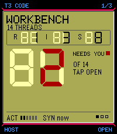
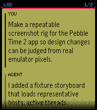
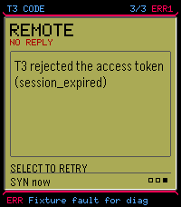

# T3 Pebble

Drive [T3 Code](https://github.com/pingdotgg/t3code) threads from a Pebble Time 2,
over your tailnet. The watch app is a normal Pebble C app; the phone-side
PebbleKit JS bridge talks straight to T3 Code's REST orchestration API. No bridge
process, no T3 Code fork, no server patch — it runs against the published `t3`
CLI (verified against `t3@0.0.33`).

| Host dashboard | Transcript | Host offline |
| --- | --- | --- |
|  |  |  |

## Quick Start

### 1. Get the watch app onto your Pebble

Grab `dist/t3pebble.pbw` from a clone and build it:

```sh
git clone git@github.com:twodotwill/t3pebble.git
cd t3pebble
./verify-t3pebble.sh
```

That writes the installable bundle to `dist/t3pebble.pbw`. Install it through the
Pebble tooling or the Core Devices/Pebble phone app. Building needs the Pebble
SDK on your `PATH` — check with `pebble --version`.

### 2. Run the launcher on the machine T3 Code lives on

Needs Node.js 22.16+, 23.11+ or 24.10+, plus `t3`, `tailscale` and `curl`:

```sh
npm install -g t3
brew install tailscale   # or your platform's package manager

curl -fsSL https://raw.githubusercontent.com/twodotwill/t3pebble/main/run-t3code-tailscale.sh \
  | T3PEBBLE_TAILSCALE_SERVE=1 bash
```

No checkout is needed on that machine — the script fetches its own helpers. From
a clone, `./run-t3code-tailscale.sh` behaves identically. Pin a revision with
`T3PEBBLE_REF=<tag-or-sha>` instead of tracking `main`.

### 3. Paste what it prints into the watch app settings

The script binds T3 Code to your tailnet, mints a long-lived bearer token, and
prints a single setup line:

```text
t3pebble1|beta1|https://beta1.tailnet.ts.net|<token>
```

Open the app settings from the phone app, paste that line under **Quick setup**,
and press **Add from paste**.

Run the script on each machine you want to reach and paste every line — together
or one at a time. Pasting a machine's line again refreshes its token in place
rather than adding a duplicate, so re-running it after a token expires is all it
takes. Up to 6 machines can be configured; each gets its own row on the watch,
they are queried in parallel, and one that is asleep shows as `offline` without
holding up the others.

## Controls

**Host screen** — one row per machine, with its thread counts.

| | |
| --- | --- |
| Up / Down | Move between machines |
| Select | Open that machine's threads |
| Select (hold) | Diagnostics — the fault log, kept on the watch instead of flashing errors |

**Thread list** — active threads first: anything running, waiting or erroring.

| | |
| --- | --- |
| Up / Down | Move between threads |
| Select | Open the thread |
| Select (hold) | Thread actions — Settle and Interrupt on an active thread, Unsettle on a settled one |
| Last row | Switches scope: `SETTLED 34` opens the settled list, `ACTIVE 6` comes back. A `MORE 20 OF 34` row fetches the next page. |

**Thread detail** — title, project path, provider, status and latest summary.

| | |
| --- | --- |
| Select | Reply by dictation |
| Down | Full transcript, a page at a time |
| Back | Return to the list |

Dictating `stop`, `interrupt` or `cancel turn` interrupts a running turn.
Approval and user-input prompts from T3 Code are answered the same way.

Ordering is by activity, so a thread that aged out sits where its work left it
rather than where the server noticed. Threads settle themselves after three days
of quiet, matching T3 Code's own sidebar, so most of the settled list is work
nobody explicitly closed.

## Creating A Project From The Watch

Set a **Project root** for a host in settings, then pick `New project` under the
project list and dictate a name. The phone resolves it to an absolute path and
shows it; nothing is created until you confirm:

```text
"sparkle renderer"  ->  /home/will/Projects/sparkle-renderer
```

Confirming dispatches `project.create` with `createWorkspaceRootIfMissing`, so
the directory is made for you.

Holding **Select** on that same row instead describes the location out loud. A
**concierge project**, named in settings, has its agent work out the path and
propose it. The agent only proposes — the watch still creates it after you
approve, so the confirmation stays a real gate.

## Reference

- [docs/tailscale.md](docs/tailscale.md) — launch script environment variables,
  Tailscale Serve mode, and the macOS `tailscale is required` stop.
- [docs/t3code-compatibility.md](docs/t3code-compatibility.md) — the exact T3
  Code API surface this depends on.

Settings can also be filled in by hand instead of pasting:

```text
Base URL:     http://<tailscale-ip>:3773
Access token: <token from t3 auth session issue>
```

Issue one directly with:

```sh
t3 auth session issue --ttl 365d --label "T3 Pebble watch" --token-only
```

Tokens are listed and revoked with `t3 auth session list` and
`t3 auth session revoke <session-id>`.

## Development

Fast phone bridge tests:

```sh
cd pebblecode
node --check src/pkjs/index.js
node test/bridge.test.js
node test/bridge.integration.test.js
```

Full local verification, including the Pebble build and a smoke test against a
real stock T3 Code server:

```sh
./verify-t3pebble.sh
```

The smoke test starts `t3 serve` on a throwaway data directory, checks that
`/api/orchestration/snapshot` refuses an unauthenticated read, and checks that it
answers a bearer token.

Screenshots are captured from the emery emulator with:

```sh
./capture-pebble-screenshots.sh
```

That builds a copy of the app with `SCREENSHOT_FIXTURES` forced on, drives it
through a fixture storyboard, and writes PNGs to `dist/pebble-screenshots/`. It
needs Docker: the local `pebble` command is a Docker wrapper and cannot keep one
emulator alive across commands.

## Why This Exists

Pebble is too constrained to run a full T3 Code client. The phone-side PebbleKit
JS bridge gives the watch a compact control surface while the laptop remains the
execution environment. Tailscale provides the private network path between phone
and laptop.

No T3 Code runtime changes are required. All Pebble-specific logic lives in this
app.
